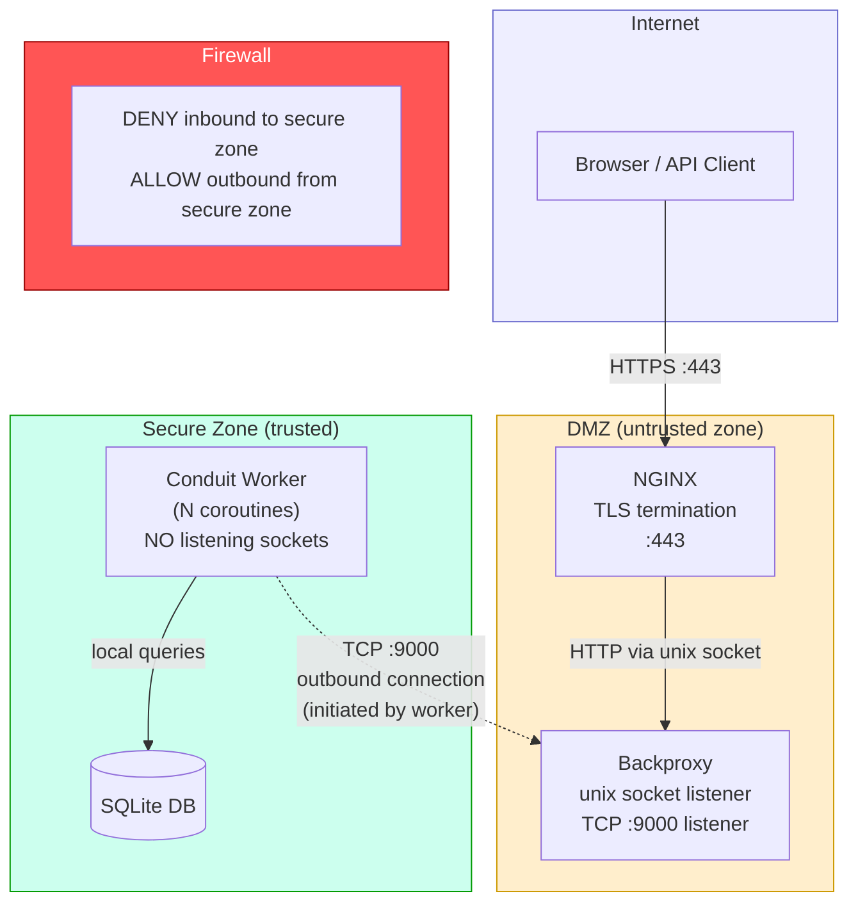
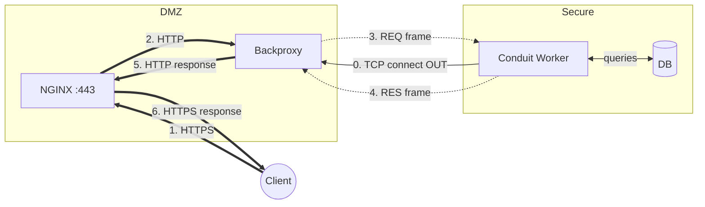
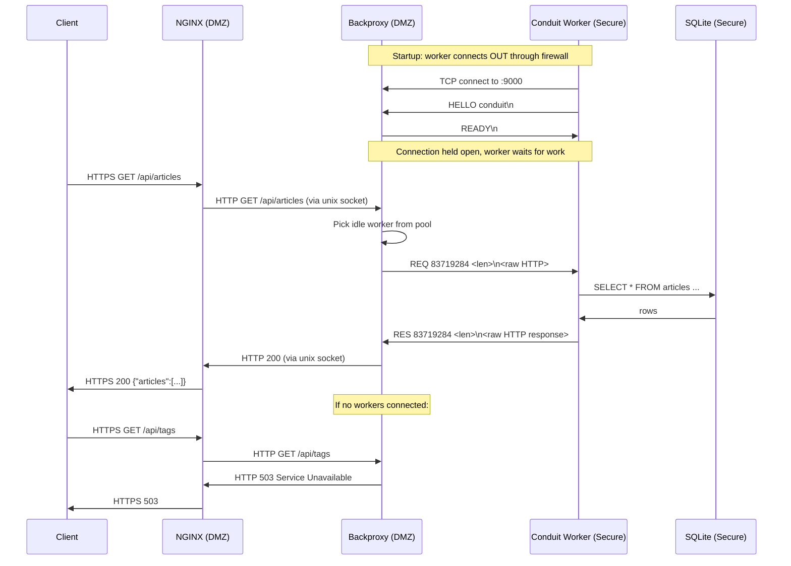

# Lunet Backflow Proxy

## Problem

A compromised host in a DMZ can be used as a pivot to attack internal systems. If your application server accepts inbound connections from the DMZ, an attacker who owns a DMZ host can connect in and probe your internal network, your database, your secrets.

The standard mitigation: **the internal network never accepts inbound connections**. Firewalls enforce this -- only outbound TCP from the secure zone to the DMZ is permitted. Nothing can connect in.

But your application still needs to serve HTTP to the internet. The database lives in the secure zone. How do you get requests in and responses out without opening inbound ports?

## Approach

The internal application connects **out** to a broker in the DMZ. The broker holds these connections open. When an HTTP request arrives (via NGINX), the broker dispatches it down one of these pre-established connections. The application processes the request (including DB queries), and the response flows back up the same connection.

**If the DMZ broker is compromised**, the attacker:
- Cannot open new connections into the secure zone (firewall blocks inbound)
- Can only send data down connections the internal app already established
- The internal app only processes well-formed HTTP requests via the framing protocol
- The attacker has no direct access to the database or internal network

The trust boundary is the firewall. The internal app chooses when and where to connect. It never listens.

## Component Diagram



## Network Flow Diagram

Shows the direction of **TCP connection initiation** vs **data flow**. The key insight: connections only open outward, but data (requests/responses) flows both ways over those connections.



## Request Lifecycle (Sequence Diagram)



## Wire Protocol

Over the outbound TCP connection between worker and broker:

```
Worker connects -> sends: HELLO <service>\n
Broker responds:          READY\n
Broker sends request:     REQ <id> <len>\n<raw HTTP payload>
Worker sends response:    RES <id> <len>\n<raw HTTP payload>
```

## Ports / Sockets

| What | Zone | Direction | Purpose |
|------|------|-----------|---------|
| `:443` | DMZ | Internet -> NGINX | TLS termination |
| `/tmp/backproxy.sock` | DMZ | NGINX -> Backproxy | Cleartext HTTP over unix socket |
| TCP `:9000` | DMZ | Secure -> DMZ (outbound) | Workers connect TO the broker |
| SQLite DB | Secure | Local only | Never exposed to any network |

## Prerequisites

- [xmake](https://xmake.io/) build system
- [lunet](https://github.com/lua-lunet/lunet) as a sibling directory (`../lunet`)
- `sqlite3` CLI (for database initialisation)
- `nginx` (for TLS termination)
- `openssl` (for dev cert generation)

## Run

```bash
# 1. Build lunet + sqlite3 driver (if needed)
xmake build-lunet

# 2. Generate dev TLS cert
./scripts/gen-dev-cert.sh

# 3. Initialise database
xmake init-db

# 4. Start DMZ backproxy (terminal 1)
./scripts/start-dmz.sh

# 5. Start Conduit workers (terminal 2)
./scripts/start-internal.sh

# 6. Start NGINX (terminal 3)
./scripts/start-nginx.sh

# 7. Test
./scripts/curl-test.sh
```

## Environment Variables

### DMZ (backproxy)
- `UNIX_SOCKET` - unix socket path (default `/tmp/backproxy.sock`)
- `BACKFLOW_HOST` - TCP bind host for workers (default `127.0.0.1`)
- `BACKFLOW_PORT` - TCP bind port for workers (default `9000`)

### Secure zone (Conduit workers)
- `DMZ_HOST` - backproxy TCP host to connect to (default `127.0.0.1`)
- `BACKFLOW_PORT` - backproxy TCP port to connect to (default `9000`)
- `WORKERS` - number of worker coroutines (default `4`)
- `DB_PATH` - SQLite database path (default `.tmp/conduit.sqlite3`)
