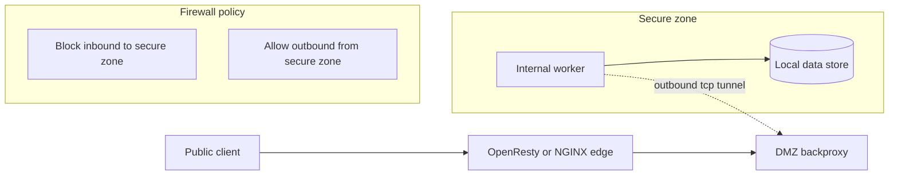
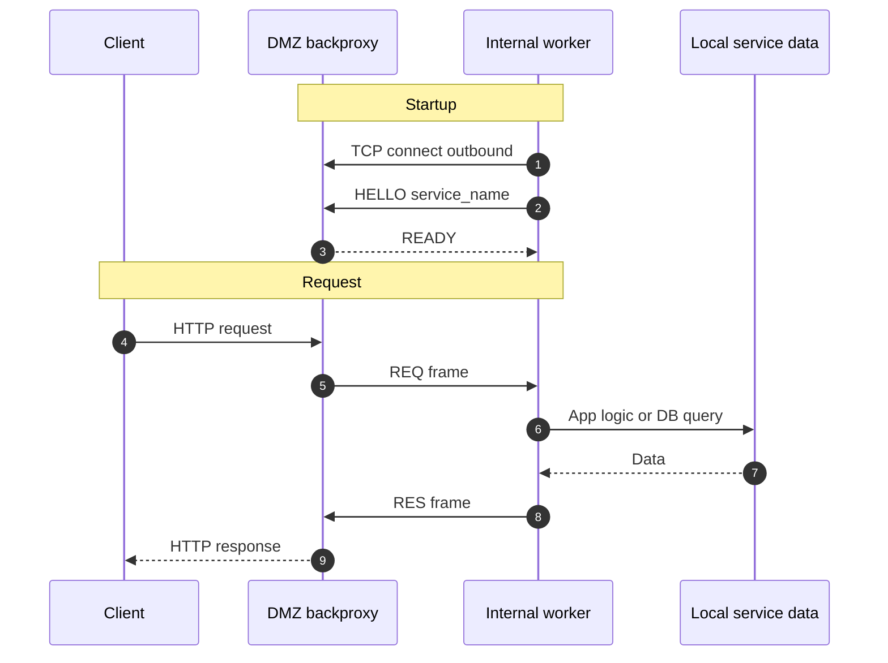

# Lunet Backproxy

Secure reverse outbound proxy for DMZ topologies.

This project demonstrates a security model where internal services never accept inbound network connections. Internal workers connect out to the DMZ broker, and HTTP requests are tunneled over those outbound connections.

## Design stance

This project intentionally follows the Unix way and the QMail security model:

- one process, one focused job
- strict process separation across trust boundaries
- use specialized perimeter software for perimeter threats

`lunet-backproxy` is intentionally barebones and fast. Its job is request brokering over outbound worker tunnels using Lunet/libuv.

`lunet-backproxy` is **not** intended to replace OpenResty/NGINX/WAF functionality.

By design, perimeter concerns belong in dedicated fronting components:

- TLS termination and certificate lifecycle
- DDoS and flood handling
- slow-client / slowloris mitigation
- request throttling and rate limiting
- edge authentication and access policy
- CVE-driven hardening cadence for perimeter software

This is why the backproxy itself does not implement TLS and does not try to become a full security gateway.

## Why this exists

Classic DMZ designs often leave an inbound path from DMZ to internal app servers. If DMZ is compromised, that path can be used to pivot deeper into the network.

`lunet-backproxy` removes that inbound path:

- Internal service opens outbound TCP to DMZ broker
- DMZ broker reuses those established connections for request dispatch
- Internal service still reaches local DB/resources, but does not listen on a public/internal inbound port

The secure deployment pattern is:

1. OpenResty or NGINX at the edge for transport and abuse controls.
2. Backproxy in DMZ for fast tunnel brokering only.
3. Internal workers behind outbound-only firewall policy.

## Architecture

### Component diagram



### Request sequence



## Runtime policy

This repo is pinned to Lunet commit:

- `6303e54e3a52a6aed30bdff058d7d77535e076aa`

Default setup builds that exact upstream ref from GitHub source and stages a local runtime under `.tmp/runtime`.

- `scripts/setup-lunet.sh` prepares the pinned runtime from `https://github.com/lua-lunet/lunet`
- No local sibling `../lunet` checkout is required
- To intentionally override, set:
  - `LUNET_REF=<tag-or-commit>`
  - `LUNET_USE_PREBUILT=1` (only for release tags that publish assets)

Canonical Lunet build, tracing, and ASan workflows live upstream:

- [lua-lunet/lunet docs/XMAKE_INTEGRATION.md](https://github.com/lua-lunet/lunet/blob/main/docs/XMAKE_INTEGRATION.md)

## Boundary of responsibility

Backproxy responsibilities:

- maintain worker tunnel pool
- dispatch framed requests to available workers
- return responses with minimal overhead

Out-of-scope responsibilities (must be handled by OpenResty/NGINX/other security tooling):

- TLS, mTLS, certificate management
- WAF rules and request filtering
- DDoS/flood controls and connection shaping
- rate limits and abuse throttling
- public authentication and edge authorization

## Demos

The backproxy is the core solution. Demos are for validation and integration examples.

- `echo` demo: minimal internal service for tunnel validation
- `conduit` demo: larger RealWorld-style example showing DB and request handler integration

`conduit` exists as a realistic test app, not as the product itself.
It is optional and can be disabled in test runs with `ENABLE_CONDUIT_DEMO=0`.

## Build your own internal service

You do not need the conduit demo architecture. A custom internal service only needs:

1. A handler function that accepts raw HTTP request bytes and returns raw HTTP response bytes.
2. A worker loop that connects outbound to DMZ using `app/internal/worker.lua`.

Minimal pattern:

```lua
local worker = require("app.internal.worker")
local http_rebuild = require("app.common.http_rebuild")

local function my_handler(raw_http_request)
    return http_rebuild.build_response(
        "200 OK",
        { ["Content-Type"] = "text/plain" },
        "hello from custom service\n"
    )
end

while true do
    worker.run_one_worker("dmz-host-or-ip", 9000, "myservice", my_handler)
end
```

Then run DMZ with matching service name:

```bash
SERVICE_NAME=myservice xmake run run-dmz
```

## Local quick start

### 1) Prepare runtime

```bash
xmake run setup-lunet
```

### 2) Run DMZ broker

```bash
SERVICE_NAME=echo xmake run run-dmz
```

### 3) Run internal service

Echo demo:

```bash
SERVICE_NAME=echo xmake run run-echo
```

Conduit demo:

```bash
SERVICE_NAME=conduit xmake run run-internal
```

### 4) Verify

```bash
curl -s http://127.0.0.1:8080/health
curl -s http://127.0.0.1:8080/hello
```

## Test

```bash
xmake test
```

This runs Lua-only unit tests plus conduit integration by default.
To run core backproxy tests without conduit demo integration:

```bash
ENABLE_CONDUIT_DEMO=0 xmake test
```

## Stress and throughput

Run real end-to-end stress on DMZ + internal Conduit path:

```bash
xmake run stress-e2e
```

Useful knobs:

```bash
REQUESTS=1500 ROUNDS=6 CONCURRENCY=24 MAX_TIME=5 xmake run stress-e2e
WORKERS=1 DB_POOL_SIZE=1 REQUESTS=5000 CONCURRENCY=128 xmake run stress-e2e
```

Compare non-instrumented vs instrumented runtime overhead:

```bash
xmake run stress-compare
```

`stress-compare` auto-detects an instrumented Lunet runtime in this order:

- `INSTRUMENTED_LUNET_BIN` (explicit, recommended)
- `LUNET_SRC_DIR/build/<os>/<arch>/debug/lunet-run`
- `.tmp/src/lunet-*/build/<os>/<arch>/debug/lunet-run`
- fallback (developer workstation convenience): `/Users/Shared/lua-lunet/lunet/build/<os>/<arch>/debug/lunet-run`

You can pass explicit instrumented runtime paths:

```bash
INSTRUMENTED_LUNET_BIN=/abs/path/to/lunet-run \
INSTRUMENTED_LUA_CPATH='/abs/path/to/?.so;/abs/path/to/?/?.so;;' \
xmake run stress-compare
```

The compare script prints:

- baseline requests/sec
- instrumented requests/sec
- overhead percentage

## Gentle load test

Example against conduit path with low worker count:

```bash
WORKERS=2 SERVICE_NAME=conduit xmake run run-internal
SERVICE_NAME=conduit xmake run run-dmz
./scripts/docker/load-gentle.sh /api/tags
```

Defaults for `scripts/docker/load-gentle.sh` are intentionally conservative:
- `REQUESTS=10`
- `CONCURRENCY=1`
- `MAX_TIME=5`

For stronger stress, raise values explicitly (for example `CONCURRENCY=4 REQUESTS=100`).
Keep this separate from normal smoke checks.

## Docker compose topology

`docker-compose.yml` simulates separate DMZ and internal zones on one host.

Start echo profile:

```bash
docker compose --profile echo up --build
```

Start conduit profile:

```bash
SERVICE_NAME=conduit docker compose --profile conduit up --build
```

Run load test from host:

```bash
./scripts/docker/load-gentle.sh /health
./scripts/docker/load-gentle.sh /api/tags
```

## Configuration

### DMZ backproxy

- `DMZ_HTTP_TRANSPORT` default `tcp` (`tcp` or `unix`)
- `HTTP_HOST` default `127.0.0.1`
- `HTTP_PORT` default `8080`
- `BACKFLOW_HOST` default `127.0.0.1`
- `BACKFLOW_PORT` default `9000`
- `SERVICE_NAME` default `conduit`
- `UNIX_SOCKET` default `/tmp/backproxy.sock`
- `BROKER_MAX_WORKERS_PER_SERVICE` default `1024`
- `HTTP_MAX_HEADER_LINES` default `256`
- `HTTP_MAX_HEADER_BYTES` default `65536`
- `HTTP_MAX_LINE_BYTES` default `8192`
- `HTTP_MAX_BODY_BYTES` default `1048576`
- `HTTP_PEER_VERIFY_MODE` default `off` (`off`, `log`, `enforce`)
- `HTTP_PEER_EXPECT_TRANSPORT` optional expected client transport (`unix` or `tcp`)
- `HTTP_PEER_ALLOWED_UIDS` optional CSV allowlist (example `33,101`)
- `HTTP_PEER_ALLOWED_GIDS` optional CSV allowlist
- `HTTP_PEER_EXE_PREFIXES` optional CSV prefix list for `/proc/<pid>/exe` (Linux)
- `HTTP_PEER_CMDLINE_PREFIXES` optional CSV prefix list for `/proc/<pid>/cmdline` (Linux)
- `HTTP_PEER_SELECTOR_POLICY_FILE` optional Lua file path returning `{ mode = "...", selectors = {...} }`

SPIRE-like selector format is supported in `HTTP_PEER_SELECTOR_POLICY_FILE`:

- selector shape: `unix:key:value`
- selectors are ANDed, similar to SPIRE registration entry matching
- supported keys: `uid`, `gid`, `transport`, `path`, `path_prefix`, `cmdline_prefix`, `sha256`

Example policy file:

```lua
return {
    mode = "enforce",
    selectors = {
        "unix:transport:unix",
        "unix:uid:33",
        "unix:gid:33",
        "unix:path_prefix:/usr/sbin/nginx",
        "unix:cmdline_prefix:nginx: worker process",
    },
}
```

Example startup:

```bash
DMZ_HTTP_TRANSPORT=unix \
HTTP_PEER_VERIFY_MODE=enforce \
HTTP_PEER_SELECTOR_POLICY_FILE=/opt/lunet-backproxy/peer-policy.lua \
xmake run run-dmz
```

### Internal workers

- `DMZ_HOST` default `127.0.0.1`
- `BACKFLOW_PORT` default `9000`
- `SERVICE_NAME` default `conduit`
- `WORKERS` default `2 x CPU cores` (minimum `2`)

### Conduit demo only

- `DB_PATH` default `.tmp/conduit.sqlite3`
- `JWT_SECRET`
- `JWT_EXPIRY`
- `ENABLE_CONDUIT_DEMO` default `1` (set `0` to skip conduit integration in tests)

### Runtime selection

- `LUNET_REF` default `6303e54e3a52a6aed30bdff058d7d77535e076aa`
- `LUNET_USE_PREBUILT` default `0`
- `LUNET_BIN` optional explicit runtime binary path (useful for instrumented runs)
- `LUA_CPATH` optional explicit module path when using custom `LUNET_BIN`

## Notes

- Testing and runtime scripts use only Lua, xmake, and shell tooling in this repo
- Historical `v0.1.0` crash reproduction harness remains in repo: `scripts/repro-segfault-v010.sh`
- This repo now defaults to the fixed upstream Lunet commit listed above
- Peer identity checks are a host-trust control for Unix sockets. They are not a perimeter replacement and can be bypassed by host root.
- Linux `/proc` checks require a runtime that can supply peer PID/UID/GID (`socket.getpeercred`). If unavailable, `enforce` mode rejects and `log` mode records the mismatch.
