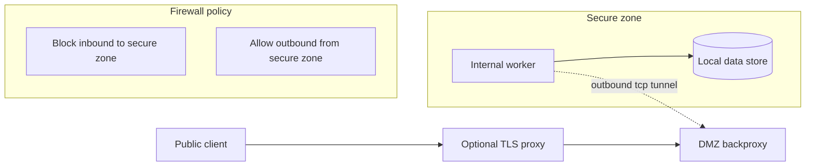
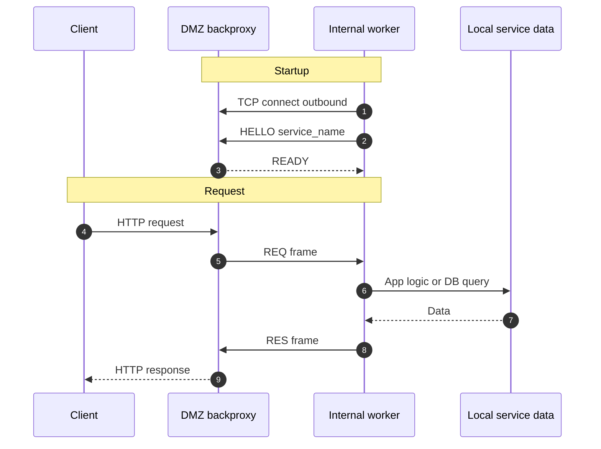

# Lunet Backproxy

Secure reverse outbound proxy for DMZ topologies.

This project demonstrates a security model where internal services never accept inbound network connections. Internal workers connect out to the DMZ broker, and HTTP requests are tunneled over those outbound connections.

## Why this exists

Classic DMZ designs often leave an inbound path from DMZ to internal app servers. If DMZ is compromised, that path can be used to pivot deeper into the network.

`lunet-backproxy` removes that inbound path:

- Internal service opens outbound TCP to DMZ broker
- DMZ broker reuses those established connections for request dispatch
- Internal service still reaches local DB/resources, but does not listen on a public/internal inbound port

## Architecture

### Component diagram



### Request sequence



## Runtime policy

This repo is pinned to Lunet `v0.1.0` from GitHub release/tag.

- `scripts/setup-lunet.sh` prepares runtime from `https://github.com/lua-lunet/lunet/releases/tag/v0.1.0`
- On platforms without a prebuilt asset (for example Linux arm64), it clones `lua-lunet/lunet` at tag `v0.1.0` and builds from source
- No local sibling `../lunet` checkout is required

## Demos

The backproxy is the core solution. Demos are for validation and integration examples.

- `echo` demo: minimal internal service for tunnel validation
- `conduit` demo: larger RealWorld-style example showing DB and request handler integration

`conduit` exists as a realistic test app, not as the product itself.

## Local quick start

### 1) Prepare runtime

```bash
xmake setup-lunet
```

### 2) Run DMZ broker

```bash
SERVICE_NAME=echo xmake run-dmz
```

### 3) Run internal service

Echo demo:

```bash
SERVICE_NAME=echo xmake run-echo
```

Conduit demo:

```bash
SERVICE_NAME=conduit xmake run-internal
```

### 4) Verify

```bash
curl -s http://127.0.0.1:8080/health
curl -s http://127.0.0.1:8080/hello
```

## Test

```bash
xmake test
```

This runs Lua-only unit tests plus integration test through the DMZ backproxy path.

## Gentle load test

Example against conduit path with low worker count:

```bash
WORKERS=2 SERVICE_NAME=conduit xmake run-internal
SERVICE_NAME=conduit xmake run-dmz
./scripts/docker/load-gentle.sh /api/tags
```

## Docker compose topology

`docker-compose.yml` simulates separate DMZ and internal zones on one host.

Start echo profile:

```bash
docker compose --profile echo up --build
```

Start conduit profile:

```bash
SERVICE_NAME=conduit docker compose --profile conduit up --build
```

Run load test from host:

```bash
./scripts/docker/load-gentle.sh /health
./scripts/docker/load-gentle.sh /api/tags
```

## Configuration

### DMZ backproxy

- `HTTP_HOST` default `127.0.0.1`
- `HTTP_PORT` default `8080`
- `BACKFLOW_HOST` default `127.0.0.1`
- `BACKFLOW_PORT` default `9000`
- `SERVICE_NAME` default `conduit`
- `UNIX_SOCKET` default `/tmp/backproxy.sock`

### Internal workers

- `DMZ_HOST` default `127.0.0.1`
- `BACKFLOW_PORT` default `9000`
- `SERVICE_NAME` default `conduit`
- `WORKERS` default `2 x CPU cores` (minimum `2`)

### Conduit demo only

- `DB_PATH` default `.tmp/conduit.sqlite3`
- `JWT_SECRET`
- `JWT_EXPIRY`

## Notes

- Testing and runtime scripts use only Lua, xmake, and shell tooling in this repo
- If Lunet `v0.1.0` compatibility issues are discovered, open an issue in `lua-lunet/lunet` with repro steps
